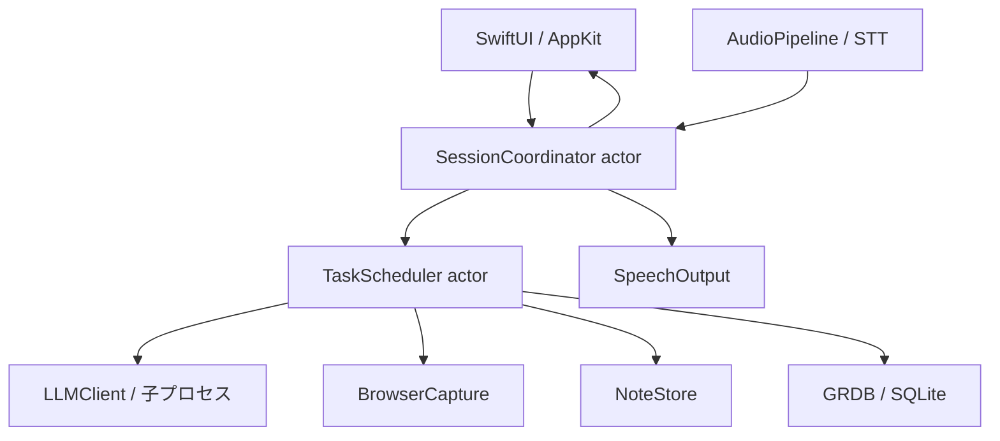
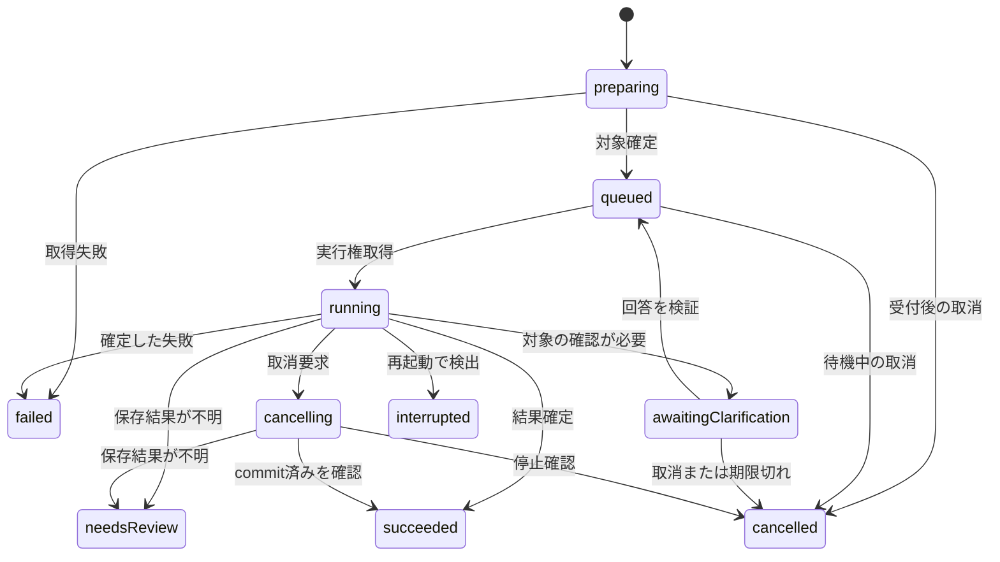

# OASIS PoC 設計書

> リポジトリへの取込み注記：本書は会話内でレビュー済みのPoC案です。既存のMVP資料との方針差があります。[取込み・差分メモ](README.md)を先に読み、未解決の差分を既存方針の変更承認と解釈しないでください。

- 文書ID：OASIS-POC-DESIGN
- 版：1.1 / 作成日：2026-09-19（日本時間）
- 状態：独立レビューを反映した実装開始用の設計案。実装・ビルド・実機試験は未実施
- 対応計画：[oasis-poc-plan.md](oasis-poc-plan.md)
- 対象実装者：GPT6-astra、GPT5.6-Sol、GPT5.6-Terra、および人間の開発者

## 1. 本書の位置付け

OASISは、ユーザーが好きな呼び名を設定でき、ローカルで会話・情報整理・限定した操作を行うOSSのAIエージェントである。本PoCは初期公開版すべてを作る工程ではなく、主要な技術リスクを実装と測定で解消する工程とする。

実装者のモデルによって仕様を変えない。判断が必要な箇所を、固定する設計、測定後に決める事項、対象外に分ける。本書のインターフェースは自プロジェクトの設計契約であり、第三者SDKに同名APIが存在するという意味ではない。

### 1.1 正本と優先順位

1. ユーザーからの最新の明示的な変更指示。
2. `local-voice-agent-requirements.md` 版0.4。今回確認した現行内容は180行。
3. `local-voice-agent-technology-selection.md` 版0.1。今回確認した現行内容は175行。
4. 本設計書。PoC内の具体的な選択と制限を定義する。
5. 開発計画書、実装、テスト。

矛盾があれば上位の内容を優先し、差分をADRに記録する。PoCの省略事項で初期公開版の要件を削除しない。元文書は今回変更していない。

### 1.2 前提の訂正・補足

- 基準端末は **MacBook Air M2・16GB**。以前の回答にあった24GBは採用しない。
- 正確なmacOS・Xcode・Swiftのバージョンは実機で記録する。「最新」を再現条件にしない。
- 製品名は会話で決定したOASIS。呼び名のPoC初期値は「オアシス」とする新規設計案。名称の正式な英語展開は本書では作らない。
- 性能数値は未合意。本書・計画書にある数値はPoCの暫定評価線であり、製品の保証や実測値ではない。
- 本文の日時はISO 8601 UTCで記録し、画面ではローカル時刻に変換する。時間差計測は単調増加時計を使う。

## 2. PoCの成果と範囲

### 2.1 必須となる縦の動作

1. メニューバーからアプリを起動し、モデルとMarkdown保存先を設定する。
2. 文字入力または押して話す方式（PTT）で依頼する。
3. ローカルLLMが日本語で応答し、テキスト表示と読み上げを行う。
4. ChromeまたはSafariの記事本文を依頼時に取得する。
5. 「要約してメモして」で要約・元URL・日時をMarkdownに保存する。
6. 読み上げ停止とタスクキャンセルを区別する。追加依頼は待ち行列に入る。
7. 呼び名検出を有効化し、変更した日本語名でも開始できるか測定する。
8. 状態に連動する抽象的な表示を行い、他アプリの操作を妨げない。

段階実装では、貼り付けた本文を使って4を先に進められる。ただし、貼り付けだけでブラウザ取得を合格扱いにしない。

### 2.2 範囲分類

| 区分 | 内容 | 完了の意味 |
| --- | --- | --- |
| 統合必須 | 文字入力、PTT、ローカル会話、音声応答、Markdown新規保存・追記、タスク制御、簡易UI、計測 | 実装と受け入れ試験が通る |
| 高リスク必須検証 | 呼び名変更、スピーカー使用時の音声割り込み、Chrome・Safariの本文取得、Appleメモ連携 | 動く検証コードと実測結果、または再現可能な阻害要因を残す |
| 比較は条件付き | MLX、Apple SpeechAnalyzer、専用wake-wordモデル、TTSKit、高度な描画 | 第一候補が評価線を満たさない理由に対応するものだけ試す |
| 初期公開版へ延期 | 自動的な長期記憶、30日保持の整理・期限削除、完全なモデル選択UI、自動起動、署名・公証・Sparkle | 対応Issueと不足事項を残す |
| 対象外 | iPhone・Ubuntu版、任意サーバー、同期、MCP、外部AI推論、返信送信、汎用GUI自動操作 | 実装しない |

Appleメモは独立プローブを必須とし、統合アプリの保存先はMarkdownに固定する。一般ユーザー向けのAppleメモ選択UIは後工程。画面の自動クリックを行わないため、操作の一時停止・画面再確認・再開（F17）の実装は本PoCには含めない。

### 2.3 判定は二段階

- **PoC実施完了**：予定した検証を実施し、成功・失敗・環境不足を区別した報告がある。
- **MVP着手可能**：統合必須項目が通り、高リスク項目にも採用方式または明示した代替案がある。

「検証で失敗した」と「未検証」は区別する。重要項目が失敗したままPoC成功とは報告しない。

## 3. 技術と設計判断

| 領域 | PoCの選択 | 理由・境界 |
| --- | --- | --- |
| アプリ | Swift、SwiftUI、AppKit、Swift Concurrency | 合意済みの基盤 |
| ビルド | Xcodeプロジェクト＋ローカルSwift Package | `.xcodeproj`と共有schemeをコミットする |
| LLM | llama.cppの`llama-server`をアプリが子プロセスとして管理 | 推論エンジンの第一候補を維持し、クラッシュ隔離・停止を検証しやすくする新規設計判断 |
| 初期LLMモデル | Qwen3-4B-GGUF、Q4_K_M、非thinking動作 | 既存の比較基準候補を具体化。最終採用ではない |
| STT | WhisperKit、多言語smallを第一測定対象、baseを比較対象 | 正確なCore ML配布ID・revisionは環境固定時に確認。`.en`モデルは禁止 |
| VAD | Silero VAD ONNX＋ONNX Runtimeを最初に検証 | Swift/macOS結合は未検証。SPM製品・API・モデル入出力をプローブで固定 |
| TTS | AVSpeechSynthesizer、端末に導入済みの日本語音声 | オフライン実機確認必須 |
| wake-word | VADで切り出した発話を軽量STTで認識し、呼び名と照合 | 任意名の基準方式。待機負荷次第で専用検出器を比較 |
| 保存 | GRDB.swift、SQLite、Markdownファイル | DBと外部ファイルの非原子的更新を扱う |
| 記事抽出 | Mozilla Readability、固定版を同梱 | DOM取得と本文抽出は分離する |
| ブラウザ取得 | PoCは固定AppleScriptによるDOM取得を先行検証 | 拡張機能は既存選定で「候補」。PoCの簡易経路として追加。使えなければ拡張機能プローブへ進む |
| テスト | Swift Testing、XCTest、実機手順 | 制御ロジックとOS依存挙動を分ける |

llama.cppはローカルHTTPサーバーとストリーミング等のAPIを提供する。PoCではそれをアプリ内部の推論境界として使う。[llama.cpp公式](https://github.com/ggml-org/llama.cpp/blob/master/tools/server/README.md)

Qwenの公式GGUF配布を評価元とし、取得ファイル・revision・SHA-256を固定する。非thinking設定は選んだllama.cppのテンプレートとの組み合わせで実証する。[公式モデルカード](https://huggingface.co/Qwen/Qwen3-4B-GGUF)

WhisperKit、Silero、ONNX Runtimeの組み合わせは、存在確認と本端末での統合成功を区別する。サンプルをビルドし、モデルをローカルだけでロードできた時点で依存を固定する。[Argmax](https://github.com/argmaxinc/argmax-oss-swift)、[Silero](https://github.com/snakers4/silero-vad)、[ONNX Runtime SPM](https://github.com/microsoft/onnxruntime-swift-package-manager)

### 3.1 バージョン固定規則

本書作成時点でビルドしていないため、動作確認済みのバージョンを捏造しない。P00-aで公式資料に基づく候補を記録し、P00-bでMac実機の環境と基盤依存を固定する。P01のOS非依存な型・fake・fixture作成はP00-a後に先行できるが、Macビルドを未実施のまま完了にしない。P02/P04で個別エンジンのartifactと実APIを最終確定し、結果をlockへ反映する。

- `xcodebuild -version`、`swift --version`、`sw_vers`、CPU/RAM、ビルド対象OS。
- Deployment TargetのPoC開始値はmacOS 14.0。採用依存がより新しいOSを要求する場合は、その理由と実機OSを確認して最小限引き上げる。
- SPMは正確なrevisionを含む`Package.resolved`をコミットする。ブランチの追従運用をしない。
- llama.cppのcommit、ビルドオプション、実行ファイルのハッシュを記録する。
- モデルmanifestに配布元・revision・ファイル名・byte数・SHA-256・ライセンスURL・用途を記録する。
- Readabilityの版・ライセンス・同梱ファイルハッシュを記録する。
- `Config/toolchain.json`、`Config/models.lock.json`、`docs/poc/environment.md`を生成する。未取得値を適当な値で埋めない。

## 4. アーキテクチャと責務



| コンポーネント | 責務 | してはいけないこと |
| --- | --- | --- |
| AppViewModel（MainActor） | UI用の状態投影、ユーザーイベント送信 | 推論・DB・ファイル処理を同期実行 |
| SessionCoordinator（actor） | 会話セッション、入力の正規化、制御命令の振り分け | 長時間の同期処理でactorを占有 |
| TaskScheduler（actor） | キュー、実行権、世代、キャンセル、完了反映 | LLM出力を無検証で操作に変換 |
| LLMClient | 起動、health確認、tokenize、生成、cancel、終了 | リモート推論先への切替 |
| AudioPipeline | 収音、変換、VAD、STT、音量レベルイベント | 音声コールバック内の推論・DB・重いロック |
| BrowserCapture | 依頼時の対象を固定し、本文snapshotを作成 | 実行開始時に別タブへ取り直す |
| NoteStore | 作成済みメモの識別、新規保存、追記、再整合 | 任意パス・任意AppleScriptをLLMから受け取る |
| Store | 会話・タスク・メモ操作記録、マイグレーション | 音声データや機密本文を診断ログに出す |
| Telemetry | 相関ID、状態・時間・サイズ・リソース | 応答・プロンプト・URLをデフォルトで記録 |

アプリの初期起動で依存を組み立てるComposition Rootを1箇所に置く。実装はconstructor injectionで差し替え、productionコードでfakeへの自動フォールバックをしない。

## 5. ドメインとインターフェース契約

値は原則`Sendable`・`Codable`、識別子はUUID文字列。本文はUTF-8。OSオブジェクトやDB行を直接ドメインへ渡さない。

| 型 | 必須フィールド・意味 |
| --- | --- |
| UserRequest | requestId、sessionId、receivedAt、inputSource(text/ptt/wake)、text、resolution(pending/resolved/clarification)、intent?、snapshotId?、targetNoteId?、targetMessageId?、outputDestinationRef |
| PageSnapshot | snapshotId、requestId、browser、tabLocator?、url、title、capturedAt、plainText、contentHash、captureMethod、coverage(full/partial) |
| AgentTask | taskId、requestId、sequence、status、phase、generation、intent?、snapshotId?、targetNoteId?、targetMessageId?、resultRef?、errorCode? |
| TaskResult | taskId、kind(answer/note)、text、noteId?、outcome(succeeded/failed/cancelled/uncertain) |
| SpeechItem | speechId、taskId?、generation、text、priority、status |
| ModelDescriptor | modelId、source、revision、files、hashes、contextTokens、template、reasoningMode、licenseURL |
| AgentError | code、stage、retryable、userMessage、diagnosticId、taskId? |

`intent`は`chat / summarize / summarizeAndSave / createNote / appendNote / searchOwnNotes / shortenResponse`。自由文の受付時はintent=nil、resolution=pendingを許可する。分類後に許可されたintentと検証済み引数を保存してresolvedへ変える。`shortenResponse`は受付時のtargetMessageIdを必須とし、生成開始時に最新応答へ取り直さない。保存操作は伴わず、対象が存在しない・削除済みならTARGET_MISSINGで終了する。停止等はタスクintentにせず制御イベントにする。

```swift
// プロジェクト独自の境界例。SDKを直接模倣したAPIではない。
protocol LLMClient: Sendable {
    func prepare(model: ModelDescriptor) async throws
    func countTokens(_ request: GenerationRequest) async throws -> Int
    func stream(_ request: GenerationRequest) async throws
      -> AsyncThrowingStream<GenerationEvent, Error>
    func cancel(generationID: UUID) async
    func shutdown() async
}
protocol BrowserCapture: Sendable {
    func capture(_ target: CaptureTarget, requestID: UUID) async throws -> PageSnapshot
}
protocol NoteStore: Sendable {
    func create(_ draft: NoteDraft, operationID: UUID) async throws -> NoteReceipt
    func append(_ change: NoteAppend, operationID: UUID) async throws -> NoteReceipt
    func searchOwnNotes(_ query: String, limit: Int) async throws -> [NoteReference]
}
```

- `GenerationEvent`は`delta(text)`、`completed(usage)`。失敗はstreamのthrow。正常終了にはcompletedが1回必要。
- `cancel`は冪等。呼出しの戻りだけで推論停止確認とはしない。cancel開始後は同じ世代のdeltaを捨て、ワーカー停止確認まで次の生成を開始しない。
- `NoteReceipt`はnoteId、operationId、保存先、保存時刻、contentHash、commit状態。成功応答はreceipt取得後。
- CaptureTargetは`browserTab(BrowserTarget)`または`explicitURL(URL)`。BrowserTargetは受付時に解決したbrowser bundle ID、process identity、window/tab locator、expectedURL、resolvedAtを持つ。未対応アプリに対し別ブラウザへ自動転送しない。adapterは実行時の最前面を取り直さず、固定対象の存在とURLを検査する。安定したlocatorを取れない場合は同じタブと証明できる条件をプローブで限定し、証明不能ならTARGET_CHANGEDとする。
- `GenerationRequest`はgenerationId（生成ごとのUUID）、taskId、taskGeneration、purpose(classify/summarize/chat/shorten)、messages、maxOutputTokensを持つ。1タスク内の分類・各chunk・統合生成ごとにgenerationIdを発行し、cancel(generationID:)にはこのgenerationIdを渡す。UserRequest.requestIdとは別の識別子として扱う。
- 音声境界は`AudioCapture.start/stop`、`SpeechRecognizer.transcribe(segment)`、`SpeechOutput.speak/stop`を用意。音声サンプルは一時メモリ所有権を明示し、タスク履歴へ入れない。

## 6. 状態機械・順序・競合

### 6.1 状態を分ける

| 軸 | 状態 |
| --- | --- |
| セッション | inactive、active、awaitingClarification |
| 音声待機 | disabled、wakeListening、capturing、transcribing、unavailable |
| タスク | preparing、queued、awaitingClarification、running、cancelling、succeeded、failed、cancelled、interrupted、needsReview |
| TTS | idle、speaking、stopped |

`running.phase`はclassifying、summarizing、generating、saving。アプリ全体を単一の「処理中」フラグにしない。



### 6.2 固定する不変条件

1. LLMの同時生成は最大1件。STT・制御受付・UIは並行する。STTも1ワーカーで、古いwake候補を無制限に溜めない。待機STTは最大1候補だけ保持し、PTT/active入力を優先する。STT処理中の新しい音声区間は1件まで保持し、さらに来たら入力過負荷を表示して再入力を促す。
2. 停止・キャンセル・待機停止はLLMや重い処理キューを経由せず受付する。
3. actorのawaitの前後でtaskId・generation・statusを再検査する。取消後に戻った結果を保存しない。
4. 待機順序はsequenceで確定。優先変更は待機中タスクだけを対象とし、実行中をプリエンプトしない。
5. タスク間でsnapshot、保存先、対象メモを共有可変値にしない。
6. 同じ状態の完了通知を二度出さない。遅延する生成イベントは世代不一致で破棄する。ただしcommit許可済み保存のreceiptはoperationIdで照合して受け取り、保存結果を失わない。needsReview/interruptedは処理を止める状態であり最終的な成功・失敗の確定ではない。再照合でsucceeded/failedへ遷移したら「結果を確認した」と更新通知する。
7. 保存操作のcommit開始後は結果確認を優先する。保存済み変更をキャンセルで自動削除しない。commit直前にschedulerで世代と取消状態を検査し、同期的にcommit許可を確定する。この許可を取消との順序決定点とし、その前の取消では書き込まない。許可後の取消は保存結果を待ち、保存済みならsucceededとして「保存は完了、以後の処理を停止」と表示する。結果不明ならneedsReviewとする。
8. マイク待機停止はマイクを解放し、生音声バッファを破棄する。LLMと実行中タスクは継続する。

### 6.3 入力と制御の規則

| 入力 | 挙動 |
| --- | --- |
| 「読み上げを止めて」 | 現在のTTSだけ停止。対象タスクの残りの自動読み上げも抑制。要約や保存は継続 |
| 「止めて」 | TTS中なら同上。それ以外で実行タスクが1件ならそのタスクをキャンセル。対象なしは何もしない旨を表示 |
| 「キャンセルして」 | 明示taskIdがなければ実行中タスク。実行なし・待機1件ならその1件。複数候補なら選択UI |
| 「短くして」 | TTS停止。最後の完成応答を対象に短縮タスクを待機列へ追加。完成応答なしなら案内 |
| 「そっちを先に」 | 選択中の待機taskIdを先頭へ。参照が曖昧なら選択UI |
| 「さっきのメモに追記」 | セッション内の最後の成功noteIdを受付時に固定。なければ既存の作成済み候補を提示 |
| 「ありがとう」「終了」 | 正規化後の発話全体が一致するとセッションをinactiveへ。現在TTSを止め、終了時点で既存の実行・待機タスクの自動TTSを抑制する。タスクは継続し、完了は画面だけで通知。音声待機ONならwakeへ戻り、OFFならマイク解放。処理済み変更を取り消さない。 |
| 無言 | active、TTSなし、処理なし、確認待ちなしの状態が30秒続けばinactiveへ。30秒はPoC仮値 |
| 「再開して」 | 本PoCには一時停止したGUI操作がないため、対象外と案内。cancelledタスクを自動再実行しない |

制御命令はUnicode正規化・前後空白と末尾句読点の除去後、許可された発話全体を比較する。「止めてという言葉をメモして」は停止命令にしない。文字入力の停止ボタンとtaskId指定操作を常に提供する。

キュー上限は未実行5件（preparing/queued/awaitingClarificationの合計）＋実行1件。満杯なら明示的に拒否し入力欄は保持。追加依頼は受付完了を即表示し、回答生成自体は順番待ちになることを示す。PoCでは「処理中も会話可能」を受付継続として部分検証し、重い推論との完全な同時対話を達成したとは扱わない。

### 6.4 受付予約と確認待ち

- 入力受付時にschedulerが同期的にrequestId・taskId・sequence・未実行枠を予約し、preparingを永続化する。取得完了順でsequenceを振り直さない。上限なら本文取得を開始する前に拒否する。保存先も受付時にoutputDestinationRefへ固定する。
- 先頭のpreparingが未完了の間は後続を自動的に追い越させない。取得は§10のtimeoutで終わり、失敗・取消で枠を解放する。明示的な待機順変更はpreparing/queuedを対象に可能。
- 分類後の不足情報はawaitingClarificationにし、重い処理枠を解放する。後続の準備済みタスクは実行できる。確認カードはtaskId付きで、選択した対象・引数を同じタスクへ適用する。参照不明の回答を別タスクへ流用しない。
- 確認待ちは5分（PoC仮値）でcancelledにする。回答後は同じsequenceでqueuedへ戻すが、実行中タスクを中断しない。通常の無言30秒とは別タイマーとする。
- activeなタスクが確認待ちへ移る時に未実行5枠が埋まっている場合は、タスクをfailed/QUEUE_FULLにして入力を保持し、確認カードから新規依頼として再送できるようにする。上限を黙って超えない。

## 7. 主要処理フロー

### 7.1 「この記事を要約してメモして」

1. 呼びかけ開始またはショートカット受付時に最前面アプリを記録する。会話パネル表示で対象がOASISへ変わらないようにする。
2. 依頼受付時に枠・sequence・保存先を予約してpreparingへ進める。ページ参照が明示された場合は対象タブ・URL・本文を取得する。本文snapshotを完成させるまでタスクを実行可能にしない。
3. 取得の前後で同じタブ識別子・URLか検査する。切替で不一致なら`TARGET_CHANGED`。新しいタブを勝手に採用しない。
4. snapshotを保存し、既に予約したtaskIdへ紐付け、sequenceを維持してqueuedへ進める。
5. 実行権取得後、token数を検査し、要約を生成する。
6. operationId＝タスク内の保存操作UUIDとしてDBへ保存予定を記録する。
7. Markdownを確定し、DBへnoteIdとreceiptを記録する。
8. 「保存しました」と短く通知し、画面に要約とメモへの導線を表示する。

取得完了後のタブ変更は結果に影響させない。取得前の切替を許容して「指示時点の本文」と称しない。継続会話の「この記事」は新しい依頼の受付時に対象を取得し、「さっきの記事」は同一セッションの直前snapshotIdへ明示的に固定する。文字入力でOASISが最前面の場合は、パネルを開いた時に記録した対象を画面に表示し、利用者がその対象で実行するか選び直す。記録のないブラウザへ推測で接続しない。

### 7.2 意図判定とツール実行

UIの明示アクションはSwiftでintentを確定する。自由文の分類にはLLMを利用できるが、許可されたintentと引数だけのJSON Schemaを使う。分類は生成枠を使うため待機中となり、制御命令とは別経路。

```json
{
  "intent": "summarizeAndSave",
  "target": "capturedPage",
  "noteText": null,
  "query": null
}
```

- `additionalProperties:false`、intentは列挙、文字列長に上限。JSON不正・未知intentは`INTENT_UNRESOLVED`とし、修復推論は最大1回。
- ページ本文をintent分類の入力に含めない。本文は要約時のデータとする。
- ページを現在対象として取得する固定表現は「この記事」「このページ」「これを要約」。直前snapshotへの固定表現は「さっきの記事」。これら以外で自由文がページを参照するか曖昧な場合は、UIでcapture対象を明示してもらう。後の分類で本文が必要と判明しても、遡って取得済みとしない。ユーザーに対象を選び直してもらう。
- LLMは任意のコマンド・ファイルパス・スクリプト・URLアクセス先を決定しない。ツール引数はSwiftで検証する。
- サマリーの内容に「保存しました」と含まれても、アプリの保存結果を上書きしない。

## 8. ローカル推論

### 8.1 プロセスと通信

- llama-serverはアプリ所有の子プロセスとして起動。外部サーバー設定はPoC UIに設けない。
- bindは127.0.0.1限定、起動ごとのランダム認証token。固定の公開ポート、0.0.0.0、CORS全許可は使わない。
- 起動前に候補ポートを選び、競合時は新規ポートで最大3回。既存プロセスをkillしない。ヘルスと認証を確認してから利用する。
- 利用する最小APIはhealth、tokenize、chat completionのstream。具体的なpath・認証・SSE形式は固定revisionの公式仕様をP02で記録する。
- streamはUTF-8やSSEが複数ネットワークchunkに跨ることを想定して復元する。
- 起動待ち120秒、初回token30秒、生成120秒をPoCタイムアウトとする。期限超過は異常終了で、性能測定の成功サンプルに含めない。
- cancelでHTTP接続を閉じ、推論停止を観測する。2秒以内に止まらない、または確認できない場合は自分の子プロセスを終了させて再起動する。TERM後さらに2秒停止しなければ自分のPIDだけKILL。次タスクはモデル準備完了後。
- 終了時は子プロセスを回収する。親クラッシュ後の孤児対策はlauncherの親PID監視と終了試験で確認する。名前一致による一括killは禁止。

### 8.2 文脈予算

PoC開始値はcontext 4,096 tokens、通常出力最大512 tokens。内訳の開始値：system 512、会話・指示512、本文2,432、生成512、余裕128。実際のchat template適用後tokenizeを正とし、超過したまま送らない。

- 直近会話は最大4往復、予算超過時は古い往復から落とす。systemと現在の指示は落とさない。それだけで生成余裕を含む上限を超える場合はINPUT_TOO_LARGEとし、推論を開始しない。
- 本文が2,432 tokensを超える場合は段落境界で分割し、最大4chunkを順番に要約後、最終統合する。1段落だけで上限を超える場合はPoCではINPUT_TOO_LARGEと明示拒否する。chunk要約は各256 tokensを上限とする。分類・各chunk・統合・短縮も、各回のtemplate適用後のtoken数＋最大出力＋余裕で検査する。統合入力も超過したら同じエラーとし、再帰的な追加要約を勝手に始めない。
- 4chunkでも収まらないときは`INPUT_TOO_LARGE`。勝手に末尾を削って全体要約と称しない。
- chunkごとにキャンセルを確認し、中途の要約は「未完了」として扱い、自動保存しない。
- 推論設定は非thinking、temperature 0.2、最大出力等をmanifest・測定記録に残す。同一seedでも結果の完全一致は保証しない。
- 会話は完成した応答からTTSへ渡す。PoC初期ではtoken単位の音声合成を実装しない。実測が遅い場合のみ文単位TTSを別ADRで検討する。

## 9. 音声・呼び名・割り込み

### 9.1 音声データ

- AVAudioEngineの入力形式を実機から取得。別ワーカーで16kHz・mono・Float32へ変換する。
- VADのframe長・state tensorは採用モデルの契約に合わせ、固定値を推測しない。Silero開始設定の候補はspeech threshold 0.5、無音終端700ms、最小発話250ms。
- preroll 300ms、1発話最大20秒、バッファ最大30秒。上限時は切り捨てを隠さず入力再試行を案内する。
- 生音声はRAMのみ。認識終了・取消・マイク停止時に参照を解放する。診断録音は別の明示的な試験操作だけで行う。
- 無音からの幻覚文字起こしをVADで抑止。認識不能はLLMに送らない。
- 音声機器変更・スリープ復帰・権限取消はengineを停止してunavailableへ。復帰後に利用者が再開できる。

### 9.2 呼び名

- 初期呼び名「オアシス」、設定で2〜20文字のひらがな・カタカナを許可。表示名と読みを別フィールドにする。
- Unicode正規化、カタカナ→ひらがな変換、空白・句読点の除去後に照合。曖昧な部分一致や編集距離照合を初期実装で使わない。
- 単独の呼び名、または先頭の呼び名＋依頼だけを受け付ける。発話途中に名前が含まれるだけでは起動しない。
- 名前変更時は旧名のbuffer・検出状態を捨てる。再検出抑止は2秒。
- 待機中はVAD＋多言語base STTを基準とする。会話用smallとの同時常駐・切替負荷を測り、メモリ不足ならbase共用を比較する。
- 待機停止中は呼び名に反応しない。PTTと文字入力は利用可能。
- 専用検出モデルとの比較は日本語任意名を検証できる候補がある場合だけ実施。候補が見つからない場合は「比較不可」と記録し、対応済みとは書かない。

### 9.3 音声状態の対応

| 条件 | マイク・検出の扱い | 次の状態 |
| --- | --- | --- |
| inactive＋音声待機ON | VAD＋wake照合 | 検出でactive、続く依頼をPTTと同じ入力経路へ |
| active＋音声待機ON | 名前なしの連続VAD/STT受付 | 発話後もactiveを維持 |
| active＋TTS中 | 音声割り込み用STT、自己音声の評価条件を適用 | 制御命令でTTS停止、次の入力を受付 |
| 音声待機OFF | 自動収音を停止・マイクを解放 | 文字入力またはPTTのみ |
| 音声待機OFFでPTT押下 | 押している間だけ明示収音 | 離す/取消で認識・マイク解放。待機ONには戻さない |
| unavailable | 自動再起動を繰り返さない | 設定修復後の再開操作で復帰 |

同じ端末マイクへ複数のtapを置かず、AudioPipelineが唯一の所有者となる。wake/active/PTT/TTS用に生音声を別々に再取得しない。

### 9.4 読み上げへの割り込み

- PTT・停止ボタンによる割り込みを先に成立させる。TTS中もそれらを無効化しない。
- 音声割り込みは独立した高リスク試験とする。発話検出だけで即座にcancelせず、正規化した制御命令を確認する。
- ヘッドホンと内蔵スピーカーの結果を別に記録。自身の読み上げを制御命令として誤認しないか試す。
- 使用可能なvoice processing / echo cancellationは実機プローブで確認し、利用API・音声機器を記録。利用できない場合に動いていると仮定しない。
- 音声割り込みの誤動作が残る場合は「PTTのみ合格、音声割り込み未達」と表示して進捗報告する。機能を隠して合格にしない。

## 10. ページ本文の取得

### 10.1 PoC基準経路

AppleScriptは固定テンプレートのみ。Chrome・Safariで最前面タブのIDまたは識別情報・URL・タイトル・DOMを取得し、cloneしたdocumentをReadabilityへ渡す。抽出結果のplain textのみをLLMに渡す。ReadabilityがDOM取得をしてくれる前提にしない。[Readability公式](https://github.com/mozilla/readability)

ブラウザ側のJavaScript実行許可やAutomation権限が必要になる可能性があるため、P06で手順と動作OSを検証する。権限は利用者による設定とし、自動で設定変更しない。AppleScript側の文字列とページ本文をコード結合しない。巨大DOMでのハングはtimeoutでプローブを終了し、アプリUIを止めない。

- DOM/JSON受信は最大2MiB、抽出plain textは最大50,000文字、取得timeoutは10秒。
- 上限超過・本文空・unsupported scheme・ブラウザ内部ページは専用エラー。
- タブ変更検査は取得前後で行う。完全に原子的な取得を証明できない制限も記録する。
- スクリーンショット、OCR、他タブ列挙、履歴収集は行わない。

この簡易経路が失敗した場合は、拡張機能プローブをP06内の代替課題として起票する。Chromeはnative messaging host、SafariはSafari Web Extensionのアプリ連携を別実装として扱う。Chromeの仕組みをそのままSafariへ流用しない。[Chrome公式](https://developer.chrome.com/docs/extensions/develop/concepts/native-messaging)、[Safari公式](https://developer.apple.com/documentation/safariservices/messaging-between-the-app-and-javascript-in-a-safari-web-extension)

拡張機能を実装する場合は、requestId付きcapture要求→snapshot応答の共通JSON契約を維持する。権限、native host登録、アプリ起点要求の配送、応答timeoutについて追加ADRを完成させてから着手する。そこが未完ならブラウザ項目はblockedとする。

### 10.2 明示URL

PoCでは公開HTTPSの静的HTMLだけを扱う。URLSessionで取得し、隔離したWKWebViewへネットワークアクセスを止めたHTMLを読み込んでReadabilityを実行する。ページ由来のscript・画像・iframeを実行・取得しない。サイズ2MiB、20秒、redirect最大3回。

認証が必要なページやJavaScriptで本文が生成されるページは、現在のブラウザDOM取得または明示的な本文貼り付けを案内する。URL再取得と閲覧中DOMが同じであるとは扱わない。PoCではlocalhost・private/link-local宛ては拒否し、redirectの各段階でも宛先を確認する。

## 11. 永続化とメモ

### 11.1 SQLiteテーブル

DBは`~/Library/Application Support/OASIS-PoC/oasis.sqlite`。GRDBのmigrationを順番に適用する。[GRDB公式](https://github.com/groue/GRDB.swift)

| テーブル | 主な列 | 制約 |
| --- | --- | --- |
| sessions | id、created_at、last_active_at | PK id |
| messages | id、session_id、role、text、created_at、status | FK session、statusはcomplete/partial/failed |
| requests | id、session_id、received_at、source、text、resolution、intent、validated_args_json、target_message_id、output_destination_ref | PK id。再実行に必要な受付時情報 |
| tasks | id、request_id、session_id、intent、status、phase、sequence、generation、snapshot_id、target_note_id、error_code、clarification_json、clarification_deadline | request_id UNIQUE、requestsへのFK |
| snapshots | id、request_id、url、title、body、hash、captured_at、method | immutable、タスクから参照 |
| notes | id、backend、external_ref、title、content_hash、created_at、updated_at | backend＋external_ref UNIQUE |
| note_operations | id、task_id?、note_id、backend、destination_ref、temporary_ref、kind、state、before_hash、after_hash、payload_ref、commit_authorized_at、error_code | operation id UNIQUE。新規noteIdと確定保存先を保存前に採番・記録 |
| settings | key、value、schema_version | PK key |

外部キーは有効化する。requests.session_id→sessions、requests.target_message_id→messages（nullable）、tasks.request_id→requests、tasks.snapshot_id→snapshots（nullable）、tasks.target_note_id→notes（nullable）、snapshots.request_id→requests、messages.session_id→sessions、note_operations.task_id→tasks（nullable）とする。削除は明示的な順序と参照切離しで行い、履歴削除からnotesへの連鎖削除は設定しない。新規保存前のnote_operations.note_idは予約済みUUIDであり、notes行確定前にも記録できるよう物理FKを設けず、保存確定時のtransactionと再照合で対応を検証する。

`note_operations.state`はprepared/committed/failed/uncertain。migrationには空DBと前版からの移行試験を用意する。初回migrationは空DBから実施し、v1.0の文書を既存DBのschemaとみなさない。DBを削除して移行失敗を隠さない。

### 11.2 Markdown作成・追記

ユーザーがフォルダを選び、その配下にのみ保存する。PoCアプリは開発用の非Sandbox構成を基準とするが、保存先制約はアプリ側で守る。将来Sandboxへ移す際のbookmarkは別設計。

- 新規ファイル名は`YYYYMMDD-HHmmss-<noteUUID>.md`。タイトルをファイル名・パスとして使わない。
- UTF-8。タイトル、要約または本文、任意の元URL、保存日時、OASIS noteIdを含める。
- 同一フォルダ内にtemporary fileを作り、同期・close後にatomic renameする。作成時に既存名を上書きしない。
- note操作は1writerで直列化。追記はNSFileCoordinatorの協調書込み区間でID/inode・hashを検査し、置換直前にも再検査する。登録済み状態と変わっていれば`NOTE_CONFLICT`。元内容の復旧コピーをアプリ管理下へ保存してから置換する。
- hash検査＋renameは比較交換ではない。NSFileCoordinatorに従わない外部エディタの同時更新を完全に防げるとは保証しない。PoCの追記条件を「外部編集を止めてから実行」と表示し、既知の差分・協調書込みとの競合を拒否する。非協調の同時更新への完全な保護は未達項目としてMVPへ残す。
- 追記も全体をtemporaryへ書いてrename。operationIdをHTML commentとして記録し、二重追記を検出する。
- DBに保存予定→ファイルcommit→DB確定の順。journalには保存内容または再現可能なpayload参照とhash、noteId、保存先、temporary pathをDB transactionで先に確定する。DBとファイルをまたぐトランザクションは存在しないため、起動時にoperation markerとhashで照合する。
- ファイルcommit後の取消は保存済みを報告する。結果を確定できなければneedsReviewにする。
- 復旧コピーとtemporaryはoperationIdに紐付け、保存結果確定後のtemporaryは直ちに回収する。確定済み復旧コピーは7日で削除するPoC仮設定とし、上限を表示する。uncertainのデータは結果確認まで保持し、解決前に自動削除しない。手動の履歴全削除では確定済みの本文payload・復旧コピー・temporaryをまとめて削除するが、利用者の保存先にある確定メモ本体は削除しない。
- symlinkで保存先外へ出るパスや、任意の絶対パスの指定は受け付けない。自分が登録したnoteIdから保存先を解決する。

```markdown
<!-- oasis-note-id: <UUID> -->
<!-- oasis-operation-id: <UUID> -->
# 記事のタイトル

要約本文

- 元URL: https://example.org/article
- 保存日時: 2026-09-19T00:00:00Z
```

このURL・日時・UUIDは形式例であり、実データや実測結果ではない。

検索は作成済みnotesを対象に、タイトルと内容の正規化した部分一致から始める。PoCの最大100件を想定し、FTSの日本語性能や埋め込み検索は後で評価する。SQL引数はbindingし、既存の無関係なフォルダを走査しない。

保存operationの復旧は、起動時にschedulerを停止したまま次の表で行う。単にファイルが見つからないだけで自動再保存しない。保存先の権限・接続状態・identityを確認できない場合はuncertainとする。

| journalと保存先の状態 | 復旧結果 | 次の操作 |
| --- | --- | --- |
| marker・noteId・after_hashが一致 | committed、taskはsucceeded | receiptを再構築し、同じ保存を繰り返さない |
| 元の状態がbefore_hashと一致し、commit未実施を確認できる | failed、taskはinterrupted | 明示再実行のみ可能 |
| 新規保存先がアクセス可能で未作成、temporaryのみ | failed、taskはinterrupted | temporaryを照合して回収、明示再実行 |
| marker/hash矛盾、参照先不明、保存先にアクセス不能 | uncertain、taskはneedsReview | 再照合または利用者による確認。新規書込み禁止 |

NSFileCoordinatorは協調アクセスに用いる設計候補であり、PoC実装時に採用SDKで動作を確認する。[Apple公式](https://developer.apple.com/documentation/foundation/nsfilecoordinator)

### 11.3 Appleメモ独立プローブ

利用者が指定したテスト用アカウント・フォルダだけに新規作成し、返された識別子を保存する。同じ識別子への追記、登録済みIDからの取得、アプリ再起動後の解決、権限拒否を検証する。タイトルだけでメモを特定しない。

AppleScriptへの入力は固定処理とデータ引数を分け、メモ本文をコードとして評価しない。HTML bodyに変換する場合はescapeする。作成のtimeout後に結果が不明なら、自動で再作成しない。markerとIDで再照合し、解決しなければneedsReview。

Appleメモ内のデータがiCloud等で同期されるかはアカウント設定に依存する。完全ローカル試験には利用可能なら「このMac内」を選び、なければ同期条件を報告する。LLM推論がローカルであることとメモ保存先の同期は区別する。

### 11.4 会話と記憶のPoC制限

会話は直近の文脈再開に使用する。自動的な好み抽出・長期記憶・期限整理は実装しない。したがって30日経過後に自動削除する完成機能を装わない。PoC画面には「試験用履歴。期限整理は未実装」を表示し、全会話・snapshotを手動削除できる。

手動削除は新規受付を止め、進行中処理を取消・停止確認し、commit許可済み保存の再照合を終えてから行う。未解決operationがあればCOMMIT_UNCERTAINを表示して削除を保留する。確定したnote_operations.task_idをNULLへ切り離して本文payloadを削除し、tasks→snapshots→requests→messages→sessionsの依存順で同一DB transaction内で削除する。メモ再照合に必要なnoteId・operationId・保存先・hashだけをnotes/note_operationsに残す。セッション文脈・派生一時要約・停止済みTTS・RAM内の本文参照も破棄し、確定済みoperationの本文payload・復旧コピー・temporaryを回収する。ファイル回収に失敗した場合は削除完了と表示せず、残件の再実行導線を出す。Markdown/Appleメモは別管理で削除しない。PoCを一般ユーザー向けに常用公開する前に保持期間の要件を実装する。

再起動時はpreparing/queued/awaitingClarification/running/cancellingをinterruptedにし、保存operationを再照合する。再実行は新requestIdで行うが、先に元operationの保存済み有無を解決する。committedならメモを開く導線だけを出し、自動再保存しない。uncertainなら再照合を優先する。未保存を確認できた依頼だけ再送できる。既存snapshotの再利用時は取得日時を表示し、新しい記事を扱う場合は明示的に再取得する。

## 12. UI・権限・設定

| 表面 | 内容 |
| --- | --- |
| メニューバー | パネル表示、音声待機ON/OFF、設定、終了 |
| 会話パネル | 入力欄、PTT、テキスト応答、読み上げ停止、タスク一覧・取消・待機順序変更 |
| 設定 | 呼び名と読み、モデル状態、Markdown保存先、マイク、計測開始、履歴削除 |
| 抽象表示 | 待機48pt、active96ptを仮値。聞取り・処理・発話・成功・失敗を色以外でも区別 |

抽象表示はnon-activating NSPanelとし、常時表示部分はクリックを透過する。文字入力パネルは利用者が開いたときだけkeyになる。右下・余白24ptをPoC仮位置とし、複数画面、全画面、Spacesでの制限を試験する。Reduce Motion時は動きを止め、通常は待機15fps、active30fpsを上限目標にする。Metal化は測定で必要になった場合だけ。

ショートカット初期値はControl＋Option＋Space。global登録に失敗したら理由とメニュー操作を提示し、成功表示しない。Carbon RegisterEventHotKey等の具体方式はmacOSプローブで固定し、キー入力全体を監視する実装を選ばない。

マイクは機能を有効化した時に権限要求。Automationはブラウザ/Appleメモの操作時に要求する。PoCでは画面録画・アクセシビリティ権限を当然の前提にしない。権限拒否でも文字入力とMarkdown経路は使えるようにする。

## 13. エラー・再試行

| code | 利用者への表示例 | 自動再試行 |
| --- | --- | --- |
| MODEL_MISSING / MODEL_HASH_MISMATCH | モデルの準備が必要です | しない |
| ENGINE_START_FAILED / ENGINE_CRASHED | 推論エンジンを開始できません | エンジン再起動1回。元の保存タスクは再実行しない |
| MIC_DENIED / AUDIO_UNAVAILABLE | 音声を利用できません。文字入力できます | しない |
| STT_EMPTY / STT_FAILED | 聞き取れませんでした | しない |
| CAPTURE_DENIED / TARGET_CHANGED / CAPTURE_EMPTY | 記事を取得できませんでした | 対象の再指定を求める |
| INPUT_TOO_LARGE | 入力がPoCの上限を超えています | しない |
| TARGET_MISSING | 参照する応答またはメモが見つかりません | 対象の再指定を求める |
| INTENT_UNRESOLVED | 操作を選択してください | 分類修復のみ1回 |
| QUEUE_FULL | 待機中の依頼が上限です | しない |
| NOTE_CONFLICT / NOTE_WRITE_FAILED | 保存できませんでした | しない |
| COMMIT_UNCERTAIN | 保存結果を確認する必要があります | 再照合のみ。再書込みしない |
| TIMEOUT / CANCELLED | 時間超過／キャンセルしました | しない |

診断にはerror codeとdiagnosticIdを表示する。例外全文・個人データをそのまま画面やログへ出さない。失敗した保存について音声で「保存しました」と言わない。

## 14. 計測と試験の設計

計測eventは`schemaVersion, runId, taskId?, event, monotonicNs, wallTime, durationMs?, errorCode?, modelId, buildCommit`。本文、音声、名前、URLは既定で含めない。

主なevent：input_end、stt_complete、queued、generation_start、first_token、generation_complete、tts_start、tts_stop_requested、tts_stopped、cancel_requested、worker_stopped、note_commit、task_terminal。

発話終了→応答開始、キュー待ち、STT、first token、全生成、TTS開始、停止の各時間を分離する。短い「受け付けました」を本回答開始として計測しない。キャンセル要求受付時間と推論停止時間も分離する。

試験は計画書のAT01〜AT18を正とする。単体・契約テストはfakeの時計・エンジン・保存先を使い、実機試験は本物のLLM・STT・マイク・対象ブラウザを使う。同じ指標にfakeの測定結果を混ぜない。

## 15. リポジトリ配置

| パス | 用途 |
| --- | --- |
| `OASIS.xcodeproj` | アプリ、共有scheme OASIS-PoC、XCTest target |
| `App/` | 起動、SwiftUI、AppKit、依存組み立て、Info.plist |
| `Packages/OASISCore/` | Foundation中心のドメイン、状態機械、scheduler、protocol、Swift Testing |
| `Packages/OASISAdapters/` | LLM、Audio、Browser、Notes、Persistence、Telemetryの実装 |
| `Resources/` | Readability、プロンプト、固定AppleScript、通知表現 |
| `Config/` | toolchain、モデルmanifest、PoC初期設定 |
| `Probes/` | VAD、ブラウザ、Appleメモ、割り込み等の小さな再現コード |
| `Tests/Fixtures/` | 人工の記事、コマンド、悪意ある本文、失敗応答 |
| `scripts/` | doctor、build、test、モデル準備、計測結果集計 |
| `docs/source/` | 元要件定義書・技術選定書の確認済みコピー |
| `docs/poc/` | 本2文書、environment、progress、handoff、結果 |
| `docs/adr/` | 方式・制限・変更根拠 |
| `.github/workflows/` | macOSでのビルド・テスト |

巨大なModel/Managerクラスへ機能を集めない。ただし初期から全領域を別パッケージ・別サービスに分けない。第三者のモデルファイルや個人の計測データをGitへコミットしない。

## 16. 未確定事項の閉じ方

| ID | 未確定 | 決めるタスク | 完了条件 |
| --- | --- | --- | --- |
| D01 | toolchain・依存revision・モデルartifact | P00/P02/P04 | 再現可能なlockとsmoke test |
| D02 | llama-serverの停止確認方式 | P02 | 長い生成のcancel後、次の生成が開始可能 |
| D03 | SileroのSwift統合 | P04 | 録音fixtureと実マイクでVAD、無音、機器変更を確認 |
| D04 | 日本語呼び名の方式と負荷 | P09 | 見逃し・誤起動・待機負荷を測定 |
| D05 | スピーカー音声割り込み | P10 | echoを含む停止試験 |
| D06 | Chrome/Safariの取得経路 | P06 | 両ブラウザの対象保持、権限、上限試験 |
| D07 | Appleメモの識別・冪等性 | P11 | 作成・追記・再起動・不確定結果の報告 |
| D08 | 最終的な性能合格線 | P13 | 実測と利用体験をもとに次工程の数値案を提示 |

未確定だから実装者が自由に置換してよいわけではない。指定された第一候補→再現試験→結果記録→必要時のみ代替、の順序を守る。ライセンス決定・公開配布はPoC開発完了とは別の判断とする。

## 17. レビュー反映履歴

| 版 | 内容 |
| --- | --- |
| 1.1 | 要件・計画と実装・整合性の2系統の独立レビューを反映。受付予約、短縮intent、確認待ち、生成ID、音声状態、保存journal、外部編集保護の限界、履歴削除と再起動を具体化。計画書の依存・試験条件を同期 |

レビューは文書の整合性を対象とする。macOS API、SDK統合、性能、echo対策、ブラウザ取得、Appleメモの動作を実機で実証したものではない。