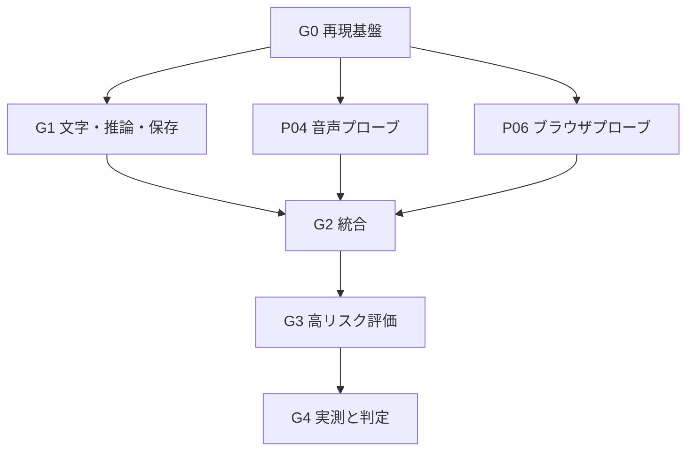

# OASIS PoC 開発計画・実装者引き継ぎ書

> リポジトリへの取込み注記：本書は会話内でレビュー済みのPoC案です。既存のMVP資料との方針差があります。[取込み・差分メモ](README.md)を先に読み、未解決の差分を既存方針の変更承認と解釈しないでください。

- 文書ID：OASIS-POC-PLAN
- 版：1.1 / 作成日：2026-09-19（日本時間）
- 状態：独立レビューを反映した実装開始用。以下のタスク・コマンド・結果ファイルはこれから作るもの
- 設計正本：[oasis-poc-design.md](oasis-poc-design.md)
- 対象：GPT6-astra、GPT5.6-Sol、GPT5.6-Terra、および人間の開発者

## 1. 最初に読むこと

モデルごとの能力差を前提に仕様を緩めない。同じ設計書、タスクID、テスト、証拠、引き継ぎ形式で開発する。モデル名による役割分担や特定モデルだけが判断できる工程は設けない。どのモデルにも動作・品質を無条件に保証する文書ではなく、判断の曖昧さと引き継ぎ漏れを減らす文書である。

今回の成果物は設計・計画の2ファイル。アプリ・GitHubリポジトリ・Issues・CIはまだ作成していない。下記コマンドは将来の実装が提供すべき契約であり、現時点でそのまま実行できる完成済みスクリプトではない。

読む順番：要件定義書0.4 → 技術選定書0.1 → 設計書 → 本書 → 最新ADR → progress/handoff。

## 2. ゴールと終了条件

### 2.1 最初の動く区切り

文字入力→ローカルLLM→テキスト応答→Markdown保存→キャンセルを、GUIから実行できるところまでを最初の区切りにする。ここまでで音声の品質問題とアプリ基盤の問題を切り分けられる。

その後、PTT→STT→会話→TTS、ブラウザ本文取得、呼び名、音声割り込みを追加する。Appleメモは小さな独立プローブで検証する。

### 2.2 最終成果物

| 成果物 | 必須内容 |
| --- | --- |
| ソース | Xcodeプロジェクト、Swift Packages、テスト、固定依存、README |
| 開発用アプリ | M2実機で動かしたbuild。公開配布・公証済みとは表示しない |
| 独立プローブ | ブラウザ、VAD、Appleメモ、音声割り込みの再現コード |
| 環境記録 | OS、Xcode、Swift、RAM、音声機器、モデル、依存commit、設定 |
| 検証結果 | AT01〜AT18のpass/fail/blocked、測定値、手順、証拠 |
| 判断記録 | 採用方式、未達、代替案、MVPへ持ち越すIssue |

実機で試していないものをpassにしない。CI成功だけで呼び名・音声・GPU・Automation権限の成功を主張しない。

## 3. 作業場所と制約

| 環境 | できること | そこで完了を証明できないこと |
| --- | --- | --- |
| macOS＋Xcode＋M2実機 | 全体ビルド、Metal推論、音声、権限、ブラウザ、Appleメモ、負荷計測 | 別OS・別端末の動作保証 |
| macOS CI | ビルド、ロジック・契約テスト、限定UI smoke | 実利用の音声機器、個人の権限、M2性能 |
| Linux等の開発環境 | 仕様整理、OS非依存部分の編集、fixture作成、差分レビュー | AppKit/SwiftUIアプリのビルド・Mac実機検証 |

クラウド開発環境のOSは実行時に確認する。サービス名だけでmacOSが使えると仮定しない。macOSがなければ独立作業を進め、Mac固有タスクをblockedとして具体的な実行手順を引き継ぐ。fakeへの差し替えを実機検証の代わりにしない。

## 4. フェーズと依存関係

| フェーズ | タスク | ゲート |
| --- | --- | --- |
| G0 再現基盤 | P00、P01 | 環境・依存固定、ビルド、テスト用境界がある |
| G1 文字で動く | P02、P03、P05 | 実LLM、キュー・取消、Markdownが動く |
| G2 音声・記事接続 | P04、P06、P07、P08 | PTT会話、記事snapshot、要約保存、UI |
| G3 リスク評価 | P09、P10、P11、P12 | 呼び名、割り込み、Appleメモ、再起動・失敗を評価 |
| G4 判定 | P13 | 実測と機能結果からMVPへの判断を記録 |



原則1タスクずつ進める。依存しないプローブは順序を交換できるが、最初から複数エージェントの並行開発を前提にしない。

## 5. Issue化できる実装タスク

各タスクは以下をIssue本文として転記できる。1タスクは下記の小区切りに分けて進めてよい。P00-a（候補・文書）→P01-a（型・fake・fixture）はMacがなくても先行できる。P00-b（Mac環境・基盤依存固定）→P01-b（Macビルド/CI）は実機が必要。P03-a（制御）→P05-a（保存）→P05-b（最小GUIの文字経路接続）がG1となる。各サブ項目を記録し、親タスクをdoneにするには全項目の証拠が必要。見積もりは日数ではなく成果物とゲートで管理する。SDK統合・権限・音声品質は環境依存のため、実測前の確約をしない。

### P00 — 環境確認・依存とモデルの固定

- 依存：なし。
- 入力：元の2文書、本設計書。
- 作業：リポジトリがあれば既存構成・AGENTS.mdを確認。OS、CPU、RAM、Xcode、Swiftを記録。依存の公式サンプルと採用候補を確認し、正確なversion/revision、ライセンス、モデルartifactを固定する。
- 成果物：`docs/poc/environment.md`、`Config/toolchain.json`、`Config/models.lock.json`、`docs/adr/0001-poc-baseline.md`、`docs/poc/progress.md`、`scripts/doctor.sh`。
- 決めるもの：macOS deployment target、アプリbundle ID（開発用`dev.oasis.poc`を開始案とし既存があれば維持）、Swift言語モード、llama.cpp commit、WhisperKit・GRDB・VAD依存、モデルrevision。
- 検証：doctorが不足を非0で返す。存在しないモデルID・ハッシュを確定値として使わない。モデル未準備でも型・fakeの作成は進められるが、該当エンジンの実機試験はblockedとする。ライセンス未決定なら公開配布は対象外と明記。
- 完了条件：P00-aは候補と未確認項目を記録。P00-bは実機環境と基盤依存の固定記録、解決可能なPackage.resolved用の値が揃うこと。個別の推論/STT/VAD artifactと実APIはP02/P04で確認してlockを更新する。実機なしならP00-bはblockedとし、P01-aだけ先行できる。電力計測に使える手段と権限もここで記録する。
- 範囲外：アプリ機能、モデル比較ランキング、公開リリース。

### P01 — ビルド基盤・ドメイン・fake・CI

- 依存：P01-aはP00-a。P01-bと親タスク完了はP00-b。
- 作業：設計書§15の最小構成を作成。共有scheme `OASIS-PoC`、SPM、swift-format設定、ビルド/テストスクリプト、macOS Actionsを追加。ドメイン型と境界を定義する。
- 成果物：`OASIS.xcodeproj`、Core/Adapters packages、`scripts/build.sh`、`scripts/test.sh`、`scripts/format-check.sh`、CI。
- fake：制御可能な時計、cancelしないLLM、遅延完了LLM、失敗するNoteStore、変化するBrowserCapture、音声イベントfixture。
- 検証：Core単体テスト、空アプリのビルド、fakeの依存注入。fake構成と実エンジン構成を明示的に切り替えられる。
- 完了条件：clean checkoutのMacでビルドと単体テストが再現し、CIの失敗が失敗として表示される。
- 範囲外：見た目の作り込み、実モデルのCIダウンロード。

### P02 — llama.cppアダプターとモデル準備

- 依存：P01。
- 作業：固定commitをMetal有効でビルドするスクリプト、model manifestからの明示ダウンロード・hash検査、子プロセス監視、認証付きloopback、SSE parser、tokenize、cancelを実装。
- 成果物：`LLMClient`実装、`scripts/prepare-models.sh`、`scripts/build-llama.sh`、`docs/poc/llm-probe.md`。
- モデル準備：必要容量・配布元を示して実行。途中ファイルは`.partial`へ置き、hash一致後に確定。モデル未準備ならネットワークへ勝手にフォールバックしない。
- 検証：AT01、AT03、AT17の推論部分。日本語1問、長い生成の取消、異常終了、ポート競合、分割されたSSE、破損モデル。
- 完了条件：実モデルの応答と停止が記録され、停止未確認中に次の生成を開始しない。モデルはGit管理外。
- 範囲外：MLXへの置換、一般向けモデルカタログ、外部AI API。

### P03 — セッション・キュー・キャンセル

- 依存：P01。実エンジン接続はP02後。
- 作業：状態機械、受付枠予約、preparing、確認待ち、制御命令、待機上限、優先変更、generation guard、再呼出し時の直近文脈を実装。自由文分類と操作バリデーションを分離する。
- 成果物：SessionCoordinator、TaskScheduler、IntentRouter、状態遷移テスト。文字入力欄・応答欄・取消だけの最小GUIをP03-aに含め、P05-bで実保存まで接続する。P08はこのGUIを拡張する。
- 検証：AT02、AT03、AT11。遅いcapture中の後続文字入力、準備中cancel、遅延capture結果、確認待ちの期限/解放、shortenResponseの対象固定を確認。fake時計で無言30秒、処理中/確認待ちの無言除外、上限拒否、対象曖昧、取消直後に届くdelta/成功イベントを試す。commit許可の直前・直後に取消を差し込み、設計書§6.2の順序どおりになることを確認する。
- 完了条件：同時LLM数が常に1以下。停止・取消が推論待ち列へ入らない。キュー順と各requestId/snapshotIdが保持される。
- 範囲外：実行中タスクのプリエンプト、汎用GUI操作の再開。

### P04 — AVAudioEngine・VAD・WhisperKitのプローブ

- 依存：P00、P01。
- 作業：実マイク入力、16kHz monoへの変換、Silero adapter、ローカルSTT、PTTを実装。small/baseの正確なartifactを固定。VADモデルの入出力と再帰状態を確認。
- 成果物：AudioPipeline、STT adapter、VAD adapter、`Probes/Audio/`、`docs/poc/audio-probe.md`。
- 検証：AT04、AT05。人工/明示許諾したfixture、実マイク、無音、20秒超、マイク拒否、音声機器切替。音声tapで重い処理をしない。
- 完了条件：日本語の認識結果とsegment終端を記録し、生音声を通常保存しない。依存不整合でSileroが使えない場合は原因・最小再現を残す。
- ブロック時：PTTの手動終端で別工程を進めてよいが、VAD/wake試験をpassにしない。別VAD採用にはADRが必要。

### P05 — DB・Markdown・メモ操作の冪等性

- 依存：P05-aはP01/P03-a。P05-bはP02/P03-a/P05-a。
- 作業：migration、settings、requests/messages/tasks/snapshots/notes/note_operations、新規保存・追記・検索・操作再照合を実装。P05-aで保存層を完了し、P05-bではP02/P03の文字→実LLM→Markdownを最小GUIへ接続する。
- 成果物：GRDB Store、MarkdownNoteStore、再整合処理、ファイル障害テスト。
- 検証：AT07、AT08、AT12。disk write失敗、外部編集、二重operationId、rename後DB更新前のクラッシュ、保存先設定変更後の復旧、保存先外へのパスを試す。hash検査後に変更を差し込む試験を用意し、協調書込みでの再検査・NOTE_CONFLICT・復旧コピーを確認する。非協調writerの保証限界は別途記録する。
- 完了条件：失敗を成功と報告しない。保存済み変更をcancelで消さない。再試行しても二重ファイル・二重追記にならない。G1では実LLMとMarkdownを最小GUIから使える。検索は日本語タイトル/本文、同名、該当なし、再起動後、無関係ファイル除外を確認する。
- 範囲外：自動記憶抽出・埋め込み検索・期限整理。

### P06 — Chrome/Safari本文snapshotのプローブ

- 依存：P00、P01。
- 作業：固定AppleScriptとReadabilityを使い、両ブラウザで取得。前後のタブ検査、権限、抽出上限、timeoutを実装。明示URLの静的HTML経路を別に実装する。
- 成果物：BrowserCapture、URLCapture、`Probes/Browser/`、`docs/poc/browser-probe.md`。
- 試験ページ：人工の静的記事、長文、見出しだけ、本文なし、遅延描画、本文内に命令がある記事。
- 検証：AT06、AT16。取得後に別タブへ移動しても元の記事。取得中の切替はTARGET_CHANGED。認証ページは手元の許可されたfixtureでDOMのみ確認。
- 完了条件：ChromeとSafariを別々にpass/fail記録。必要なブラウザ設定とOS権限の手順をREADME化。
- 失敗時：拡張機能経路の追加ADRとIssueを作る。メッセージ経路・権限・インストール方法を決めるまで大規模実装に入らない。貼り付け経路で他工程は継続可。

### P07 — エンドツーエンドの統合

- 依存：P02、P03、P04、P05、P06。P06未達の場合は貼り付け経路だけ暫定接続し、その制限を表示。
- 作業：受付予約→capture→queued→分類/要約→save→TTSの接続。AVSpeechSynthesizerの基準SpeechOutput adapterと通常再生・停止・世代管理をここで実装する。token予算、chunk要約、source URL、完了通知、対象応答ID付きshortenResponse、追記を実装。
- 成果物：基準TTS adapter、ユースケースと統合テスト、`docs/poc/e2e-probe.md`。
- 検証：AT01、AT04、AT06、AT07、AT11、AT16。本文にある偽命令で操作しない、長すぎる入力で偽の全体要約を返さない。
- 完了条件：本物の入力から本物の保存結果までtaskIdで追える。完了表示はNoteReceipt確定後。ネットワークなしで会話・手元記事の要約・Markdownが動く。
- 範囲外：token単位TTS、自由なエージェントループ。

### P08 — 常駐UI・パネル・状態表示

- 依存：P01、P03。統合確認はP07後。
- 作業：メニュー、会話パネル、設定、キュー操作、PTT、停止、非activatingの抽象表示、global shortcutを実装。
- 成果物：App UI、XCTest smoke、手動チェック記録。
- 検証：AT02、AT14。別アプリで入力中にフォーカスを奪わない、Reduce Motion、複数画面、待機停止、権限拒否、キュー満杯の表示。
- 完了条件：音声なしで主要操作ができ、状態が色だけに依存せず区別できる。
- 範囲外：最終ブランドデザイン、Metalの先行導入、一般公開インストーラー。

### P09 — 呼び名変更と継続会話

- 依存：P04、P07、P08。
- 作業：wake mode、名前正規化、先頭一致、preroll、同一発話の残り指示、クールダウン、active/inactive遷移を実装。activeでは名前照合を迂回してVAD→会話STTへ渡し、名前なしの追質問を受け付ける。終了後の既存タスク通知と音声待機OFFのPTT復帰を設計書どおりに接続する。
- 成果物：wake検出器、評価fixture、`docs/poc/wake-word-results.md`。
- 検証：AT09。3種類の名前、各20回。旧名、文中の名前、無音、TV等の背景音による誤起動。名前→質問→名前なし追質問→終了/無言→再呼び出しで文脈保持。待機OFF時のPTT利用後のマイク解放。
- 完了条件：条件別の検出率・誤起動・負荷を記録。専用モデル比較の可否と判断をADRに残す。
- 範囲外：全ての固有名詞への対応保証、声による本人認証。

### P10 — TTSとスピーカー環境での割り込み

- 依存：P04、P07、P09。
- 作業：P07で実装した基準TTSに対し、世代管理・停止・読み上げ再開抑止を再確認し、音声制御経路と利用可能なecho対策を追加・検証する。通常のTTS再生はこのタスクを待たずP07で成立させる。
- 成果物：音声割り込み対応を追加したTTS adapter、`Probes/BargeIn/`、`docs/poc/barge-in-results.md`。
- 検証：AT03、AT10。ヘッドホンと内蔵スピーカーで各20回。TTSが「止めて」を読み上げるfixture、割り込み直後の次の指示、長いLLM処理中の停止。
- 完了条件：停止成功率、停止遅延、自己音声による誤停止率を別に記録。PTT成功と音声割り込み成功を混同しない。
- ブロック時：必ず文字/PTT経路を維持し、音声割り込みは未達として報告する。

### P11 — Appleメモの独立検証

- 依存：P00、P01、P05のNoteStore契約。
- 作業：テスト用保存先を指定して新規作成、ID取得、同一IDへの追記、登録済みメモの検索、再起動、権限拒否、不確定結果を検証。
- 成果物：`Probes/AppleNotes/`、`docs/poc/apple-notes-results.md`。
- 検証：AT13。引用符・改行・HTML文字を含む本文、同名メモ2件、対象メモの外部削除、作成後timeout。
- 完了条件：IDの有効範囲・同期条件・権限を記録。自分が作成したメモだけを操作する。失敗時の自動再作成で複製を増やさない。
- 範囲外：本アプリの保存先選択UI、既存メモ全体の索引。

### P12 — エラー・再起動・観測・再現性の仕上げ

- 依存：P03、P05、P07、P08。
- 作業：interrupted復旧、保存操作再照合、マイク/子プロセス解放、計測JSONL、履歴全削除、READMEの初回セットアップを完成。
- 成果物：`scripts/verify.sh`、`scripts/summarize-metrics.*`、計測schema、再起動テスト、README。
- 検証：AT05、AT08、AT12、AT15、AT17、AT18。タスク途中にアプリ終了、LLM子プロセス強制終了、DB失敗、音声機器抜差し、初回モデルなし。
- 完了条件：fresh cloneの手順で環境を再現できる。個人データをログ/fixture/Gitへ含めない。未検証の試験がskipで成功に見えない。
- 範囲外：署名・公証・Sparkle、30日保持の本実装。

### P13 — 実機評価・採否・MVP引き継ぎ

- 依存：P02〜P12の結果が揃うこと。高リスク失敗でも評価報告自体は進められる。
- 作業：次節の条件で機能・遅延・常駐負荷を測定。失敗理由から必要な比較だけを行い、採用構成と未達をまとめる。
- 成果物：`docs/poc/results.md`、`docs/poc/metrics.csv`、`docs/adr/0002-poc-outcome.md`、MVPバックログ。
- 完了条件：各ATに実装commit・環境・pass/fail/blocked・証拠を記載。Go/Conditional Go/No-Goを理由とともに提案。
- 注意：実測値を埋める工程。空欄を例示値で埋めたり、計画値を測定値と呼んだりしない。

## 6. 受け入れ試験一覧

D＝決定的な自動テスト、R＝本物のエンジン/端末による試験。両方がある項目は両方必要。

| ID | 手順 | 期待結果 | 種別 | 対応要件 | 主担当タスク |
| --- | --- | --- | --- | --- | --- |
| AT01 | モデル準備済みでネット切断し、文字質問を送る | ローカルで応答。外部AI通信なし | R | F06、A01部分 | P02/P07 |
| AT02 | ショートカットでパネル表示、文字で2往復、無言、再表示 | 受付・表示・直近文脈が動く。処理中に無言終了しない | D/R | F03/F05/F06、A09/A12 | P03/P08 |
| AT03 | 生成中cancel、TTS中停止、cancel後の遅延delta投入 | 対象範囲だけ停止。保存/発話が復活しない | D/R | F04/F16、A04/A15 | P02/P03/P10 |
| AT04 | PTTで日本語の依頼を行う | VAD/STT/LLM/TTSが接続。音声・テキストで応答 | R | F04部分 | P04/P07 |
| AT05 | マイク拒否、入力機器変更、長すぎる発話 | 理由を表示。文字入力可能。マイク資源が解放される | D/R | F01/F06、A11 | P04/P12 |
| AT06 | Chrome/Safari各記事の取得後にタブを切替 | 元記事を処理。取得中の切替は検知・拒否 | D/R | F07/F08/F15、A02部分/A13 | P06/P07 |
| AT07 | 要約保存・追記、日本語タイトル/本文検索、同名候補、該当なし、再起動 | 元noteIdに一度だけ追記。登録済みメモのみ検索し、曖昧な対象は選択 | D/R | F09〜F11、A03 | P05/P07 |
| AT08 | disk error、協調する外部編集をhash検査後に挿入、保存途中の強制終了、同一operation再送 | 偽成功・二重保存なし。検出した差分を上書きせず、元版を復旧可能。非協調writerは制限を記録 | D/R | A11/A15 | P05/P12 |
| AT09 | 名前3種×20回、旧名/文中名/背景音、名前なし追質問、終了/無言からの再呼出し、待機OFFのPTT | 名前変更・停止・継続音声会話・文脈再開が反映され、OFFのPTT後はマイク解放 | D/R | F01/F02/F03、A08/A12 | P09 |
| AT10 | TTS中の「止めて」「短くして」を2機器条件で試す | 自己音声誤検出を記録し、次の指示を受付 | R | F04/F16、A04/A15 | P10 |
| AT11 | 長い要約中に5件追加、遅いcaptureと後続文字、優先変更、特定取消、確認待ち、6件目追加 | preparingを含む上限・受付順・対象を保持。LLM最大1件。超過は取得前に拒否 | D/R | F18、A18部分 | P03/P07 |
| AT12 | キューと保存中タスクを残し、アプリを再起動 | 自動の二重実行なし。interrupted/needsReviewを表示 | D/R | F11/F18関連 | P05/P12 |
| AT13 | Appleメモ作成・追記・再起動・同名/削除/権限拒否 | IDで対象保持。失敗・不確定を明示 | R | F09〜F11、A03/A05/A11部分 | P11 |
| AT14 | 別アプリ入力中に表示状態を切替 | フォーカスを奪わず、状態が識別可能 | R | F05/F14、A10 | P08 |
| AT15 | メモ保存後、FK有効のDBで会話履歴を手動全削除。未確定保存でも試す | 参照順に文脈・snapshotと確定済みの復旧コピー/temporaryを削除。保存メモと最小操作記録は残る。未確定保存時は保留 | D/R | データ分離の部分検証 | P12 |
| AT16 | 命令混入記事、長すぎる記事/指示/単一段落、統合入力超過、不正intent、私設URL | 許可外操作なし。明示エラー。勝手な省略なし | D/R | F07/F08、A11関連 | P06/P07 |
| AT17 | モデルなし/破損、llama crash、ポート競合、アプリ終了 | 明示エラー、所有プロセスだけ回収、他プロセス無傷 | D/R | F12部分、A01/A11 | P02/P12 |
| AT18 | 30回会話、10回要約保存、30分待機 | 遅延・負荷・安定性を条件付きで記録 | R | 非機能要件 | P13 |

A06（長期記憶）、A07/A16（汎用画面操作）、A14/A17（保持期間整理）は本PoCで受け入れ完了としない。A01の一般向けモデル選択、A02の呼び名＋両保存先統合、A18の自然な同時会話も部分検証と明示する。

## 7. 試験データと評価方法

### 7.1 fixture

個人の会話や有料記事をGitへ入れない。人工データを作る。

| fixture | 内容 | 用途 |
| --- | --- | --- |
| `commands-ja.json` | 会話10、要約10、メモ10、曖昧10、制御10、命令に見える引用10の合計60例 | intentと制御の区別 |
| `articles/positive/` | 短文4、中程度4、上限付近2の計10記事。すべて処理可能な長さ/段落 | 要約品質・10回の保存成功評価 |
| `articles/negative/` | 上限超、巨大単一段落、本文なし、命令混入、動的本文欠落 | 拒否・安全な境界。成功評価10記事の分母に含めない |
| `notes/` | 同名・外部編集・引用符・HTML・symlinkのケース | 冪等性と対象制限 |
| `events/` | cancel後delta、重複完了、save途中crash | 並行性と復旧 |
| `audio/manifest.json` | 収録同意のある試験音声の属性、期待文字起こし、保存先 | STT/VAD試験。音声本体は同意範囲で管理 |

記事ごとに原文の事実5点・含めてはいけない推測・期待する元URLを先に定義する。実LLMの文章完全一致は要求しない。

### 7.2 品質

- 要約：positiveの10記事について重要事実5点中4点以上を含み、原文に反する重要な捏造がないことを暫定目標とする。採点者・採点基準・実際の出力を記録する。
- intent：60例の正答数と混同行列を記録。許可外操作の実行は0件必須。不明扱いと誤実行を分ける。
- VAD：自然な間を含む日本語発話20件について、話の途中で終了した件数/対象発話数を測る。無音終端設定ごとに同じfixtureで比較し、応答が速くても誤終端の増加を隠さない。
- STT：日本語文字誤り率CERを記録。NFKC、空白/句読点の扱いを評価スクリプトで固定する。意味の違う固有名詞誤認も別記。
- wake：名前別の検出率、呼びかけ終了→active表示、背景音時間あたり誤起動を記録。
- barge-in：発話から音声停止までと、認識済み制御イベントから停止までを両方測る。

### 7.3 実機条件

- 基準：M2・16GB。違うRAMの実測を基準結果に混ぜない。
- OS build、Xcode、Swift、app commit、engine commit、model hash、設定、音声機器、電源接続、画面輝度、他アプリ、室内騒音条件を記録。
- cold startは3回、warm会話は30回、記事要約保存は10回。wakeは3名×20回。barge-inはヘッドホン/内蔵スピーカー各20回。
- 待機は準備後5分安定させて30分計測。音声待機OFF/ON、抽象表示OFF/ONを別条件とする。
- 電力：利用可能なInstrumentsの電力関連指標または端末で使用可能な計測手段を選び、ツール/単位/権限を記録する。端末全体の消費とアプリの代理指標を区別し、待機OFF/ON・描画OFF/ONの同条件で比較する。数値取得不能なら電力は未測定と明記し、CPU%で代用したと称しない。
- 自身のアプリ＋llama子プロセスについてCPU・メモリを1秒周期で採取。OSのmemory pressure・swap増分も記録。
- CPU%は100%＝1論理コアと明示。RSS合計は共有メモリの二重計上があり得る参考値であり、メモリpressureと併記する。
- 30サンプル程度のp95は探索的な指標。安定したSLOの証明とはしない。n、median、nearest-rank p95、max、失敗件数を載せる。
- 他アプリの入力応答は、同一条件でテキストエディタへ入力する試験を行い、明瞭な引っ掛かり・UI hangを記録する。可能ならInstrumentsで原因を確認。

### 7.4 暫定評価線

以下は今回の設計上の仮置き。既存要件の確定値ではなく、実測結果から改善優先度を決めるための値。変更する場合は測定前後の値と理由を残す。

| 指標 | PoCの暫定目標 | 未達時の扱い |
| --- | --- | --- |
| 制御受付→UI反映 | p95 200ms以内 | MainActor/actorの占有を確認 |
| 認識済み停止命令→TTS停止 | p95 300ms以内 | delegate/世代管理を確認 |
| cancel受付→LLM停止確認 | 通常p95 2秒以内 | 子プロセス終了fallbackと再ロード時間を別記 |
| warm短文会話、発話終了→本回答の音声開始 | median 3秒、p95 6秒以内 | STT/生成/TTSの内訳から改善。達成を前提にしない |
| wake検出 | 各名前20回中18回以上 | 照合・モデル・音声条件を見直す |
| 誤wake | 各30分条件で1回以下 | 日常運用保証とはせず長時間試験をMVPへ |
| 音声割り込み | 各機器20回中18回以上成功 | スピーカー環境が未達なら条件付き対応 |
| アプリ＋推論プロセスのメモリ | peak RSS合計8GiB以下を参考目標、継続的なmemory pressure悪化なし | STT共用・context縮小等を比較 |
| 音声待機時CPU | 平均10%以下（1コア＝100%） | VAD/STT頻度・wake方式を検討 |
| 安定性 | 30回会話＋10回保存でcrash/誤保存0件 | 原因修正後、関係する試験を再実施 |
| フォーカス | 無操作でのフォーカス奪取0件 | パネル構成を修正 |

誤保存、許可外操作、commit許可以前の取消を無視した保存、個人データの無断送信は性能改善と別の必須修正項目。メモリ・速度の参考目標を満たすために、それらの条件を緩めない。

## 8. 比較・撤退の判断

| 状況 | 次に試すこと | しないこと |
| --- | --- | --- |
| LLMが遅い/メモリ過大 | 入力予算確認→context/出力長を同条件で調整→MLXを同等条件で比較 | 外部AIへ無断切替 |
| STTが遅い | small/base、モデル常駐条件、機器条件を比較 | 日本語非対応モデルを速度だけで採用 |
| wake待機が重い | 発話区間の頻度、VAD誤検出、モデル共用を確認→専用モデル適合性を調査 | 日本語任意名が対応済みと仮定 |
| 音声回り込み | 音声処理API確認、ヘッドホンとスピーカー分離、PTT維持 | マイクを止めて「音声割り込み対応」と表示 |
| AppleScript取得が不成立 | 最小再現→拡張機能ADR→Chrome/Safariを個別検証 | URL再fetchを同じ閲覧中DOMとみなす |
| Appleメモの識別が不安定 | ID・marker・保存先条件の再確認、Markdown経路を維持 | 全既存メモをタイトル検索して操作 |
| 描画負荷が高い | fps・描画要素を縮小→必要時Metal検証 | 原因計測前に全面書換え |

各比較は、同一fixture・条件で基準値と比較値を残す。比較が増え続ける場合は1仮説につき1代替案までを基本とし、未解決点を明示して次工程の判断材料にする。

## 9. コマンドの契約

P01/P12で次を実装する。OS固有の実行はmacOS上で行う。CI runnerのラベルとXcode選択はP00の実在環境に合わせて固定し、未確認のバージョンを記載しない。

```bash
./scripts/doctor.sh
./scripts/build.sh
./scripts/test.sh unit
./scripts/test.sh integration
./scripts/format-check.sh
./scripts/verify.sh
```

- `doctor`：OS/toolchain/依存/モデルを表示。機密値は表示しない。通常はネットワーク変更やインストールをしない。
- `build`：共有scheme、Debug、指定destinationでビルド。コード署名の有無・設定を環境記録に明記。
- `test unit`：fake主体のドメイン・状態機械・ファイル試験。
- `test integration`：必要モデルとMac条件を確認し、本物のLLM契約試験。条件不足なら明示的なblocked結果を出し、成功扱いしない。
- `verify`：format、build、unitを実行。実機手動試験は含めず、別表の未実施一覧を表示する。
- すべて終了コードを正しく返す。テスト失敗を`|| true`等で隠さない。

CIはモデルなしでbuild/unitを必須にする。モデル統合は手動または条件の整ったrunnerで別job。runnerへの署名情報や個人データは不要な構成を優先する。production配布のsecretsをPoC CIへ加えない。

## 10. モデルを切り替えても迷わない作業規約

### 10.1 1回の実装セッション

1. `git status`、最新progress/handoff、関連ADRを確認し、既存差分を把握する。
2. 依存が完了している未完了タスクを1つ選ぶ。
3. 対象の契約・不変条件・受け入れ試験を読み、変更ファイルを絞る。
4. 小さな変更を実装し、その契約を破りやすい試験を実行する。
5. 動作が違えば、仕様変更でテストを通す前に原因を確認する。
6. 試験コマンド、終了コード、実行環境、証拠を記録する。
7. progress/handoffを更新する。途中なら次の具体的な操作を残す。

ユーザーが依頼した範囲内の通常の実装判断を毎回確認しない。対外的な公開・送信、既存データ破壊、初期要件の変更、基準技術の全面置換は別の判断として扱う。

### 10.2 タスク状態

`todo / doing / blocked / done`を使う。

- `done`：成果物と必要試験の証拠がある。
- `blocked`：環境・権限・未解決技術などで必要試験を実施できない。具体的な解除条件を記録。
- コードを書いただけ、fakeだけ通った、未実行のテストを書いた状態は、実機必須タスクのdoneではない。

### 10.3 progressの形式

```markdown
| Task | Status | Commit | Test evidence | Remaining / blocker |
| --- | --- | --- | --- | --- |
| P00 | todo | — | — | 環境確認から開始 |
```

### 10.4 handoffの形式

```markdown
# Handoff
- 日時:
- 現在のブランチ / HEAD:
- 現在のタスク:
- 完了した変更:
- 未commitのファイルと意図:
- 変更した契約 / ADR:
- 実行したコマンド / 終了コード:
- 実機試験の条件 / 結果 / 証拠:
- 実施していない試験:
- 既知の問題 / 再現手順:
- blocker / 解除条件:
- 次に実行する具体的な操作:
```

例示欄は空欄のままテンプレートとして提供している。成功したように架空のcommitや数値を記入しない。

### 10.5 レビュー観点

- cancellation後のeventが保存やTTSを再開しないか。
- requestId、taskId、snapshotId、noteId、operationIdを取り違えていないか。
- ページ本文やLLM出力が操作権限を増やしていないか。
- ファイルcommitとDB更新の間で落ちた場合に複製ができないか。
- MainActor、音声tap、actorを長時間占有していないか。
- 「未達/未実施」を成功表示していないか。
- モデル・音声・ブラウザの実データを不用意にログへ残していないか。

レビューは同じ実装者が行ってよい。複数エージェントや特定モデルの利用は必須にしない。

## 11. 開発エージェントへ渡す開始プロンプト

以下をコピーし、元の2文書と今回の2文書をリポジトリへ置いた状態で渡す。リポジトリ未作成なら、まず作業ディレクトリと初期化を行う。GitHubへの公開やpushは利用者の設定・指示に従う。

```text
OASISのPoCを実装してください。

読む順番:
1. docs/source/local-voice-agent-requirements.md
2. docs/source/local-voice-agent-technology-selection.md
3. docs/poc/oasis-poc-design.md
4. docs/poc/oasis-poc-plan.md
5. AGENTS.md（存在する場合）、docs/adr/、最新progress.md/handoff.md

目的:
ローカルLLMを使うmacOS常駐AIエージェントのPoCです。
基準端末はMacBook Air M2・16GBです。
まずP00から開始し、既に完了している場合は証拠を確認して次の依存解決済みタスクへ進んでください。

必須:
- 設計書の状態機械・契約・不変条件を守ること。
- llama.cpp/WhisperKit/SwiftUI/GRDB等を理由なく置き換えないこと。
- 依存の実APIを公式資料と固定revisionで確認し、存在しないAPIを作ったつもりで呼ばないこと。
- 1タスクずつ実装・関連試験・記録を進め、依頼された範囲の作業を継続すること。
- 文字入力とfakeの成功を、本物の音声・モデル・ブラウザの成功として扱わないこと。
- 実行環境にmacOS/Xcode/M2実機がなければ、できる独立作業を進め、できない試験の解除条件を残すこと。
- 外部AI APIにフォールバックしないこと。
- 失敗した保存を成功表示しないこと。
- モデル重み・生音声・個人データをGitへ含めないこと。
- 未完了・未実施を明示し、progress.mdとhandoff.mdを更新すること。

最終報告:
変更内容、完了したタスク、試験コマンドと結果、未実施試験、残課題、次の作業を簡潔に示してください。
```

途中でモデルを変更する場合は同じプロンプトに次を追加する。

```text
既存作業を引き継いでください。最新handoffとgit diffを先に確認し、完了済み工程をやり直さないでください。
設計の理由が不明な場合はADRと関連試験から確認し、独自の全面再設計はしないでください。
次の具体的操作から再開し、未検証部分を証拠付きで閉じてください。
```

## 12. 最終報告の雛形

```markdown
# OASIS PoC 検証結果

## 判定
- PoC実施: 完了 / 未完了
- MVP移行提案: Go / Conditional Go / No-Go
- 判定理由:

## 環境
- 端末 / RAM / OS build:
- app commit / Xcode / Swift:
- LLM / STT / VAD / TTSのrevision・モデル・設定:
- 音声機器 / 電源 / 他アプリ:

## 機能
| AT | pass/fail/blocked | 実行日 | 証拠 | 未達理由 |
| --- | --- | --- | --- | --- |

## 性能
| 指標 | n | median | p95 | max | 失敗件数 | 条件 |
| --- | --- | --- | --- | --- | --- | --- |

## 採用と変更
- 採用方式 / 根拠:
- 基準からの変更 / ADR:
- 比較しなかった方式 / 理由:

## MVPの残課題
- Issue / 対応要件 / 優先度 / 完了条件:
```

Goは統合必須項目が通り、呼び名・ブラウザ・割り込み・Appleメモの採用可否が判断でき、初期公開に向けた重大な阻害がない場合。Conditional Goは制限条件と解消Issueが明確な場合。No-Goはローカル推論・正しい対象への保存・取消の安全性等に重大な未解決がある場合。これは開発上の提案であり、一般公開の承認とは別。

## 13. PoC後のMVPバックログ

| 項目 | PoCから引き継ぐもの |
| --- | --- |
| 自動記憶と訂正・削除 | 元発言と推測の区別、派生要約・索引の削除設計 |
| 30日保持・設定変更 | 整理完了後に全文削除、メモは別管理 |
| モデル選択・ダウンロードUI | manifest、容量、ライセンス、端末別実測 |
| Appleメモの本統合 | プローブで確認したID・同期・権限・不確定結果 |
| ブラウザの一般向け導入 | PoC簡易経路から拡張機能への移行判断 |
| 会話と重い処理の体験改善 | 受付と回答の待ち時間、必要な優先度変更 |
| 自動起動・配布・更新 | 署名、公証、Sparkle、アプリ/モデルの利用条件 |
| 対応端末と性能基準 | 基準機の実測、追加端末での再試験 |
| 最終UI・呼び名の制約 | 見た目、名前別の認識性能、低負荷設定 |

最初に着手するタスクはP00。元資料を配置し、実機・依存・モデルを固定したうえでP01へ進む。

## 14. レビュー反映履歴

| 版 | 修正内容 |
| --- | --- |
| 1.1 | 基準TTSをP07へ移動しP10との依存逆転を解消。G1の最小GUI、Macなしで先行可能な作業、音声継続会話・Markdown検索・受付予約・保存復旧・履歴削除の試験を追加。成功記事と負例を分離し、電力と誤終端測定を補完 |

AT01〜AT18のIDは維持し、関連ケースを各AT内へ追加した。レビューによる修正は実装・実測の完了を意味しない。